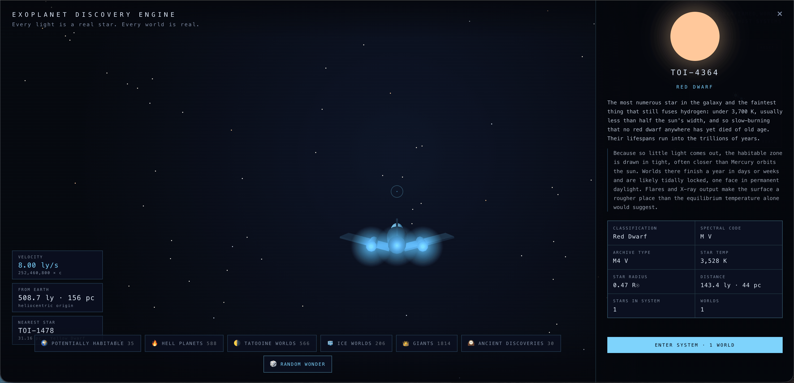

# Exoplanet Discovery Engine

An interactive 3D atlas of **6,309 real, confirmed exoplanets** from the NASA Exoplanet Archive. Every star and every world here actually exists; nothing is simulated or invented. Launch from the Sun, fly through true-scale interstellar space, and warp into any system to see its planets rendered from their real measured size, temperature, and orbit.

**Live:** [exoplanets.pocketmicros.com](https://exoplanets.pocketmicros.com)



## What's in it

- **Fly from Earth:** pilot a ship through real 3D space at true scale (1.3 pc to Proxima Centauri, 8,500 pc to the far edge of the catalog)
- **Click any star** to see its real classification (yellow dwarf, red giant, pulsar, and more) with a short write-up on that class of star
- **Enter a system** to see its planets on real orbits, textured procedurally from their actual radius, mass, and temperature
- **Survey reports:** an in-universe write-up for every planet, grounded in its real archive data
- **Discovery filters:** jump straight to potentially habitable worlds, hell planets, circumbinary "Tatooine" systems, and more
- **A minimap** tracks your journey and saves it in the browser, so you can pick up where you left off

## Run it locally

```bash
npm install
npm run dev
```

The star catalog ships with the repo (`public/data/exoplanets.json`), so it works fully offline with no API key and no backend.

## Commands

| Command | What it does |
| --- | --- |
| `npm run dev` | Dev server with hot reload |
| `npm test` | Run the test suite |
| `npm run build` | Production build into `dist/` |
| `npm run refresh-data` | Re-pull the latest snapshot from the NASA Exoplanet Archive |

## Where the data comes from

Every planet is pulled from the [NASA Exoplanet Archive](https://exoplanetarchive.ipac.caltech.edu/), the same public catalog astronomers use. `public/data/exoplanets.json` is a raw snapshot; the app derives everything else (position, classification, color) at load time. Run `npm run refresh-data` any time to pull the latest confirmed discoveries.

## Tech

React + Vite + Three.js, zero backend. See [docs/poc.md](docs/poc.md) for the original spec.
